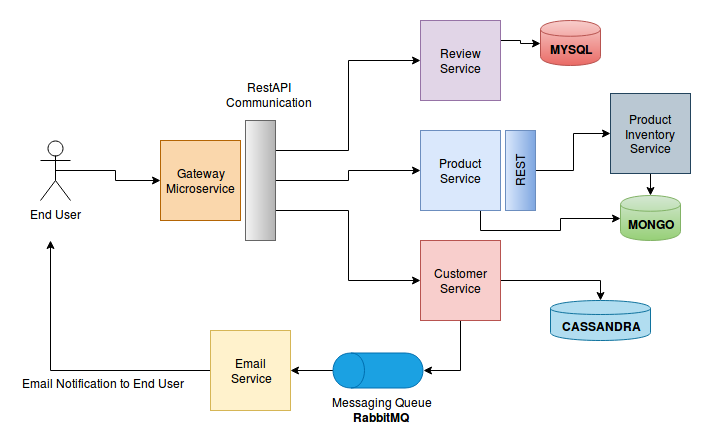

# Polyglot Persistence
POC of Polyglot persistence for Shop

### Tech Stack

* Spring Boot 2
* Spring Data JPA
* Spring HATEOS
* Spring MongoDB
* Spring Cassandra
* Spring AMQP
* Cassandra
* MongoDB
* MySQL
* Docker
* RabbitMQ

### Developer Environment

Build docker images
```
chmod +x ./docker-build.sh && ./docker-build.sh
```
### Architecture




### EndPoints : 

```
Product-Microservice :
1.Get All Products

Customer-Microservice : 
1. Create Customer
2. Gell All Customer
3. Authenticate Customer

Order-Microservice : 
1. Create Order

Inventory-Microservice : 
1. Create Inventory
2. Get Inventory for Product
3. Delete All Inventory

Review-Microservice : 
1. Add rating
2. Get rating for Product

Getway-Microservice : 
1. Get Product Details
2. Creating Customer
```
 
 